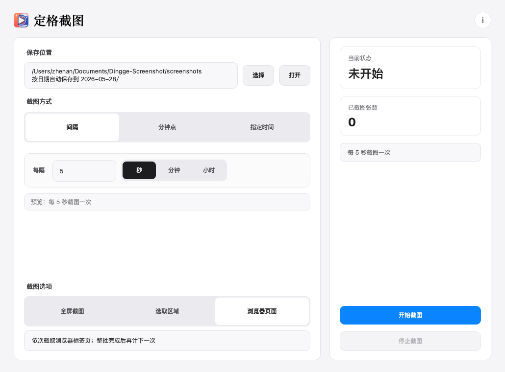
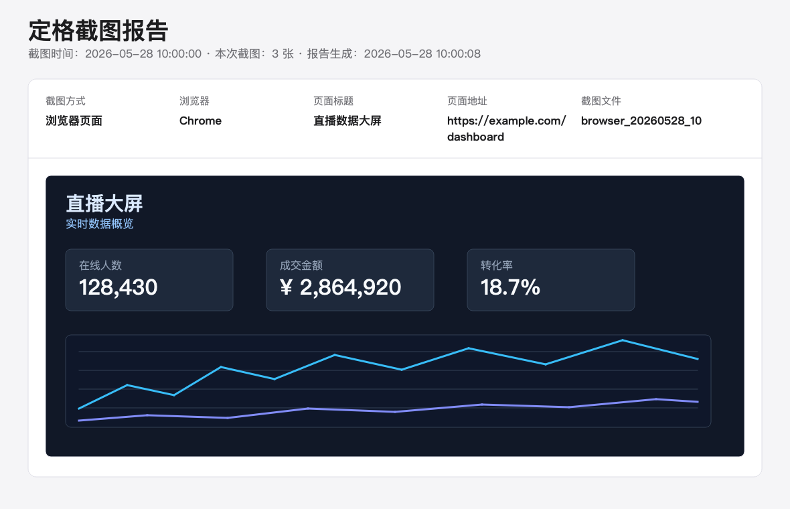

# 定格截图

定格截图是一个用 Python 和 PySide6 写的桌面定时截图工具，适合需要按固定规则自动保存屏幕画面的场景。

当前版本：v1.0.2

## 界面预览



## HTML 报告预览



## 功能

- 按固定间隔自动截图
- 按分钟点截图，例如每 1 / 3 / 5 / 10 / 30 / 60 分钟
- 按每天指定时间点截图
- 支持全屏截图和自定义选区截图
- 支持预览当前选区范围
- 支持批量截取已打开浏览器页面
- 支持自定义保存目录，并可一键打开保存目录
- 按日期自动归档截图文件
- 每次截图后自动生成 HTML 报告
- 支持单次截图快捷键
- 单次运行最多保存 10,000 张截图，达到上限后自动停止

## 最新更新

### v1.0.2

- 修复 macOS 下全局快捷键可能导致软件闪退的问题
- macOS 快捷键改为系统原生全局快捷键，软件缩到菜单栏后也可以触发单次截图
- 修复 `Command + Shift + 1` 被识别成 `Command + Shift + !` 的问题
- 优化快捷键设置页，点击快捷键框即可重新设置
- 发布包文件名加入版本号，下载时更容易区分版本

## 运行环境

- Python 3.9 或更高版本
- macOS / Windows
- PySide6_Essentials
- Windows 截图需要 Pillow

## 项目结构

```text
.
├── assets/
│   └── 定格截图logo.png
├── 定格截图.py
├── requirements.txt
├── 启动定格截图.command
├── launcher.applescript
├── 定格截图.app/
└── README.md
```

## 安装依赖

创建虚拟环境：

```bash
python3 -m venv .venv
source .venv/bin/activate
pip install -r requirements.txt
```

Windows 可以使用：

```bash
py -m venv .venv
.venv\Scripts\activate
pip install -r requirements.txt
```

## 启动方式

命令行启动：

```bash
python 定格截图.py
```

macOS 也可以双击：

- `启动定格截图.command`
- `定格截图.app`

## 打包

macOS：

```bash
bash scripts/build_macos.sh
```

Windows：

```powershell
.\scripts\build_windows.ps1
```

打包文件会生成在 `dist/` 目录中。

发布包文件名会包含当前版本号，例如：

```text
定格截图-v1.0.2-macOS.dmg
定格截图-v1.0.2-Windows.exe
```

## HTML 报告

每次截图触发后，软件会在后台生成一份 HTML 报告。

例如每小时截图一次，保存目录中会出现类似文件：

```text
screenshots/
└── 2026-05-28/
    ├── screenshot_20260528_220000.png
    └── capture_20260528_220000.html
```

如果一次触发截取了多个浏览器标签页，这些截图会放在同一份 HTML 报告里。

HTML 报告包含：

- 截图时间
- 截图方式
- 浏览器名称
- 页面标题
- 页面地址
- 截图图片

## PyCharm 使用

1. 用 PyCharm 打开项目文件夹。
2. 选择项目解释器为 `.venv`。
3. 如果还没有安装依赖，在 PyCharm Terminal 中运行：

```bash
pip install -r requirements.txt
```

4. 运行 `定格截图.py`。

## macOS 权限

macOS 首次截图或控制浏览器时，可能会弹出权限提示。

常见需要开启的权限：

- 屏幕录制：允许 Python、PyCharm、终端或定格截图读取屏幕内容。
- 自动化：允许定格截图控制 Chrome、Safari、Edge、Brave、Arc 等浏览器。
- 辅助功能：如果全局快捷键或浏览器控制没有反应，可以允许定格截图控制电脑。

如果权限没有弹出或误点了拒绝，可以到：

```text
系统设置 > 隐私与安全性
```

分别检查“屏幕录制”和“自动化”。

注意：如果你先用 PyCharm 运行，之后又改用 `.app` 运行，macOS 可能会把它们当成不同应用，需要重新授权一次。

## 浏览器页面截图说明

选择“浏览器页面”后，软件会依次截取已打开浏览器中的页面。

- macOS：通过系统自动化切换浏览器标签页，并截取浏览器窗口区域。
- Windows：逐个激活浏览器窗口，通过全屏截图和 `Ctrl+Tab` 切换标签页。

浏览器页面截图会等本轮所有页面截完后，才重新计算下一次截图时间。

## Windows 说明

普通全屏截图和选区截图依赖 Pillow 的 `ImageGrab`。

浏览器页面截图会逐个激活浏览器窗口，并通过全屏截图保存每个标签页的画面。
